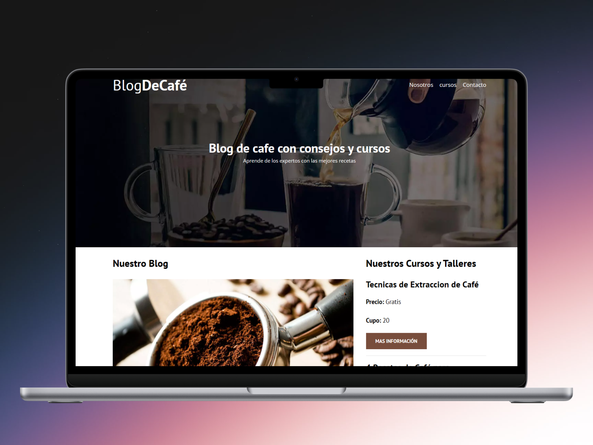
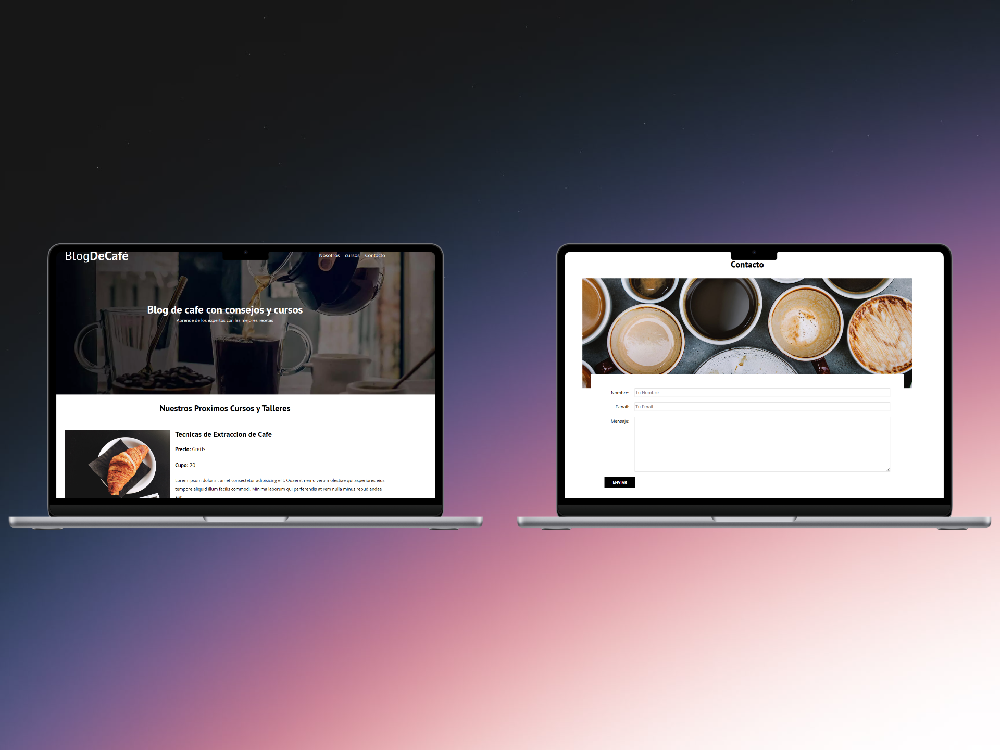
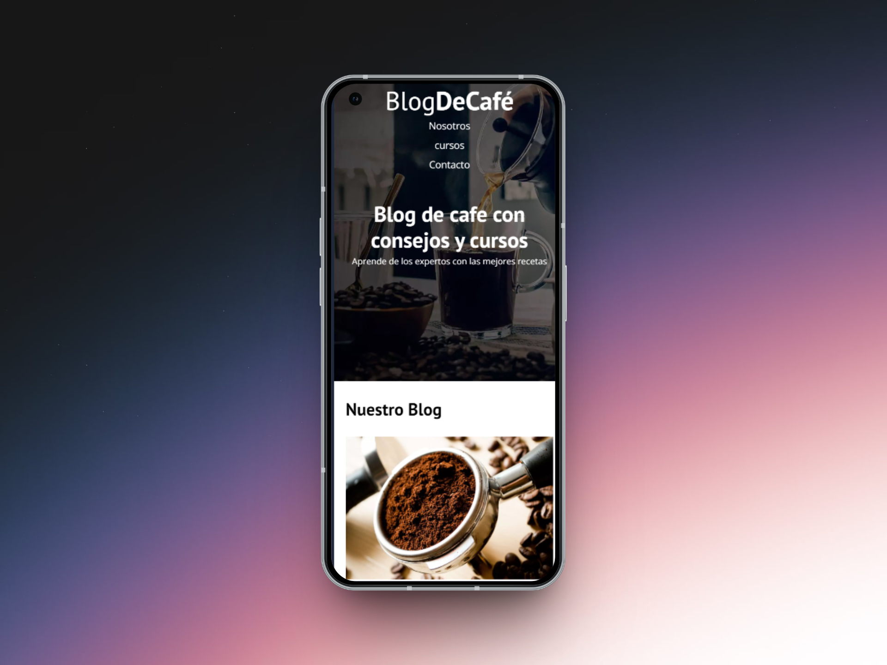
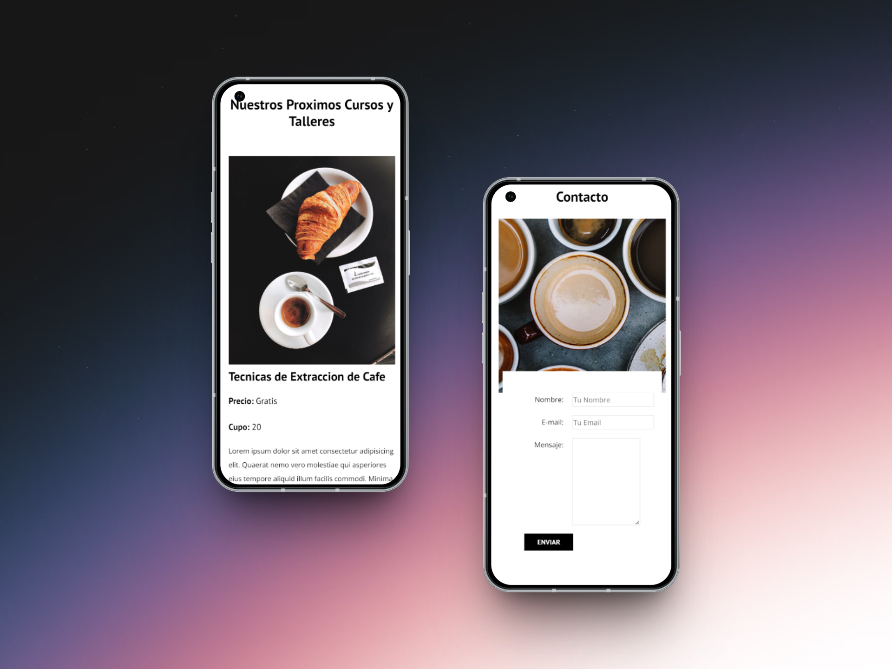

## ☕ Proyecto #3: Blog de Café Denys

Este proyecto consistió en la creación de un blog temático sobre el café, diseñado y desarrollado usando **HTML5 y CSS3**. A través de este trabajo reforcé mis habilidades en maquetación web, diseño visual y estructura semántica de contenidos.

### 🧠 Lo que aprendí:
- Crear páginas responsivas usando `media queries`.
- Aplicar `grid` y `flexbox` para organizar contenido visualmente.
- Diseñar una estructura limpia y semántica con etiquetas como `<article>`, `<aside>`, `<section>`, `<nav>`, y `<footer>`.
- Usar fuentes personalizadas, paletas de colores armónicas y un diseño consistente.

### 🌐 Enlace al proyecto:
[🔗 blog-cafedenys.netlify.app](https://blog-cafedenys.netlify.app/)

### 📸 Capturas del proyecto:

  
  

  
  

